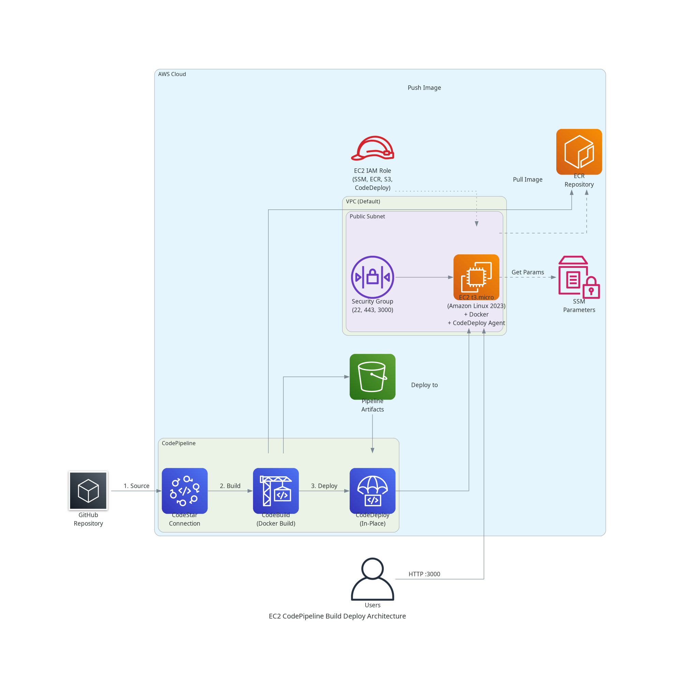

# Build and Deploy to EC2 With AWS CodePipeline

This CDK project demonstrates how to configure a complete CI/CD pipeline using AWS CodePipeline, CodeBuild, and CodeDeploy to automatically build Docker images and deploy them to an EC2 instance.



## Requirements

- [Node.js v22+](https://nodejs.org/)
- [AWS CLI v2](https://aws.amazon.com/cli/) configured with appropriate credentials
- [pnpm](https://pnpm.io/)

## AWS Services Utilized

- CodePipeline
- CodeBuild
- CodeDeploy
- EC2
- ECR (Elastic Container Registry)
- S3
- VPC
- IAM
- SSM Parameter Store
- Security Groups

## Deploying

### Prerequisites

1. **Configure AWS Credentials**

   ```bash
   aws configure
   ```

2. **Install Dependencies**

   ```bash
   pnpm install
   ```

3. **Bootstrap CDK** (first time only)

   ```bash
   cd infra
   pnpm cdk bootstrap
   ```

### Deployment Steps

1. **Navigate to Infrastructure Directory**

   ```bash
   cd infra
   ```

2. **Generate CloudFormation Template**

   ```bash
   pnpm cdk synth
   ```

3. **Review Changes**

   ```bash
   pnpm cdk diff
   ```

4. **Deploy Stack**

   ```bash
   pnpm cdk deploy
   ```

5. **Note the Outputs**
   After deployment, CDK will output important values:
   - `InstancePublicIP` - Public IP address of the EC2 instance
   - `ApiUrl` - Direct URL to access your application (<http://IP:3000>)
   - `ECRRepositoryURI` - ECR repository URI for your Docker images
   - `PipelineName` - Name of the CodePipeline pipeline

## Testing

1. Make a code change to API response in codebase
2. Push to the `main` branch
3. Pipeline automatically triggers and deploys changes
4. Hit the `http://YOUR_INSTANCE_IP:3000` to see updated response.

## Clean Up

To avoid ongoing charges, destroy the infrastructure:

```bash
cd infra
pnpm cdk destroy
```

**Note**: You may need to manually delete:

- ECR images
- S3 bucket objects
- CodeStar Connection

## License

This project is licensed under the MIT License - see the [LICENSE](LICENSE) file for details.
